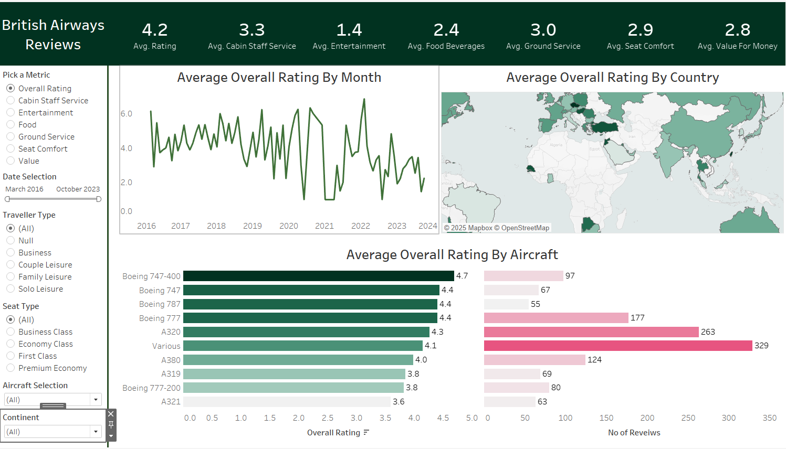

# British Airways Reviews Dashboard

## Overview
This **Tableau Dashboard** provides insights into customer reviews for **British Airways**, helping analyze various performance metrics across different aircraft, countries, and time periods.

## **Dashboard Features**
### **1. Metrics Tracked**
The dashboard provides an overall review of flights based on the following metrics:
- **Average Rating**
- **Cabin Staff Service**
- **Entertainment**
- **Food & Beverages**
- **Ground Service**
- **Seat Comfort**
- **Value for Money**

### **2. Dashboard Components**
The dashboard consists of three key visualizations:
1. **Average <Parameter> by Month**
   - Displays the selected metric's trend over time (from March 2016 to October 2023).
2. **Average <Parameter> by Country**
   - Shows the distribution of reviews across various countries.
   - Includes a **Continent filter** for focused regional analysis.
3. **Average <Parameter> by Aircraft**
   - Displays the average ratings by aircraft type.
   - Also includes the number of reviews for each aircraft model.

### **3. Interactive Filters**
The following filters allow dynamic analysis of the data:
- **Pick a Metric** - Selects one of the sub-categories (Overall Rating, Cabin Staff Service, Entertainment, etc.).
- **Date Selection** - Filters reviews based on flight date (March 2016 - October 2023).
- **Traveler Type** - Filters by reason for travel:
  - Business, Couple Leisure, Family Leisure, Solo Leisure.
- **Seat Type** - Filters by seat class:
  - Business Class, Economy Class, First Class, Premium Economy.
- **Aircraft Selection** - Filters reviews based on aircraft type (Boeing 747, A320, etc.).
  - Aircraft with fewer than 50 reviews are grouped under **'Various'**.
- **Continent Filter** - Allows data filtering by continent.

## **Data Connection & Processing**
- The dashboard is built using **two datasets**:
  1. **ba_reviews.csv** – Contains customer reviews.
  2. **Countries.csv** – Maps country names to continents for geographic filtering.
- The datasets are joined using:
  - `Place` from **ba_reviews.csv**
  - `Country` from **Countries.csv**
- The **Country dataset** is used solely for mapping and filtering based on continent.

## **Installation & Usage**
### **1. Prerequisites**
- Install **Tableau** or use **Tableau Public**.
- Download the datasets from GitHub.

### **2. Steps to Use**
1. Load the datasets into Tableau.
2. Ensure proper **joins** between `ba_reviews.csv` and `Countries.csv`.
3. Apply the necessary **filters and parameters**.
4. Interact with the dashboard to explore insights.

## **Dashboard Link**
You can access the Tableau Public dashboard here: [https://public.tableau.com/app/profile/sripal.udyavara/viz/BritishAirwaysReviewDashboard_17386975773570/Dashboard1]

## **Screenshot of the Dashboard**

## **Future Enhancements**
- **More granular sentiment analysis** using customer comments.
- **Integration with additional datasets** (e.g., flight delays, ticket pricing).
- **Machine learning-based sentiment predictions** to forecast service quality trends.

## **Author & Credits**
Developed by **Sripal Udyavara**
For inquiries, reach out via **www.linkedin.com/in/sripal-udyavara**

---
This project is open for contributions! Feel free to fork the repository and enhance it further.

